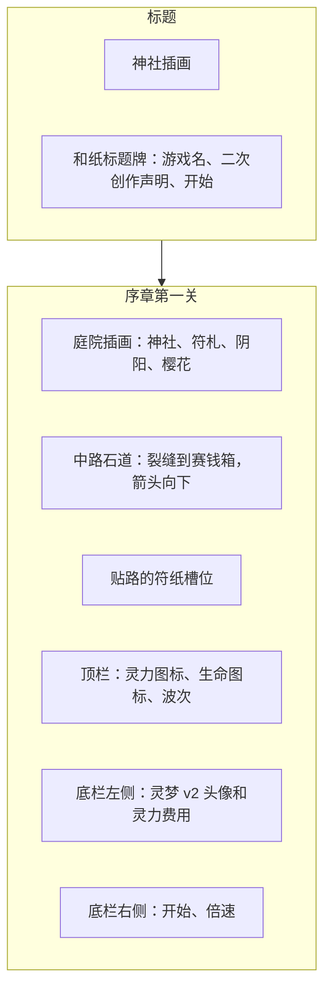

# 序章第一关画面

> 这一轮只画标题和 `prologue_01` 战斗里看得见的背景与界面。玩法不动：仍然先点格子，再点灵梦。波次和胜负不改。
> 动效（进关、按钮按下、受击的 Tween、格子呼吸）交给动效师。这里没有加 Tween。

## 信息怎么排

竖屏 1080×1920。棋盘仍是 7×12、每格 128，位置不改。角色卡放在底栏左侧，费用写在头像右边。右侧是「开始」和倍速。

依据：`docs/design/art/ui_visual_spec.md`（PR #6，`docs/art-framework` @ `fe0f3d5`）的顶栏 y 0–140、棋盘 y 140–1676、底栏 y 1676–1920；本关地图 `data/levels/prologue_01.json` @ `127aa5b`。角色外观用 PR #14 已选定的灵梦 v2（`art/t19a-character-concepts` @ `01fe51c`），本轮只裁切，不重画。

## 画了什么

| 画面 | 文件 | 说明 |
| --- | --- | --- |
| 标题背景 | `assets/textures/ui/bg_title_shrine.jpg` | 朱红神社、注连绳、符札、阴阳牌、樱花。没有角色，没有字 |
| 关卡背景 | `assets/textures/tiles/shrine/bg_prologue_01.jpg` | 神社庭院。两侧是建筑和植物，中间留出庭院，石道由棋盘按格子画上 |
| 石道 | `scripts/battle/board_view.gd` 绘制 | 只盖住路线格。入口是裂缝，尽头是赛钱箱，中间有向下的箭头 |
| 可放置格 | 同上 | 和纸符札，朱红印。选中后改金色边 |
| 灵梦头像 | `assets/textures/ui/reimu_v2_card.png` | 从已选定的 v2 裁出上半身 |
| 棋盘上的灵梦 | `assets/textures/ui/reimu_v2_token.png` | 同一张 v2 的全身缩小。不是 T-19b：没有新画的立绘，也没有待机和攻击两种姿态 |
| 顶栏图标 | `ui_icon_spirit.png`、`ui_icon_life.png` | 灵力光点和赛钱箱，Pillow 绘制 |

障碍格不铺色块，让庭院露出来。路线用实心石道压在插画上，避免插画的透视和格子对不齐时出现两条路。

## 还没做

- 交给动效师：进关、按钮缩放、受击闪白以外的 Tween、可放置格 0.8 秒呼吸、符卡按钮。这一关的程序版还没有符卡按钮，本轮不加。
- T-19b 仍等 #14 和 #12 合并后再做。魔理沙、琪露诺、紫的正式立绘和棋盘小人都不在这一轮。
- 完整的东方字体和 T-20 的三层粒子背景仍等 #12 合并。这一轮继续用仓库里的 Noto Sans SC。
